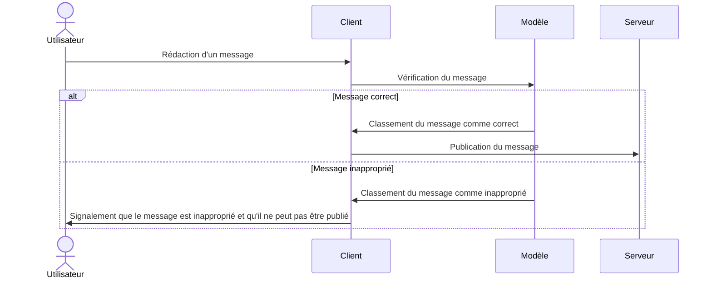

<h4 align="center">Cody ADAM & Mael KERICHARD</h4>

   
   
   

## 🌐 Accès rapide

Le projet est disponible à l'adresse suivante : [https://ai-kerichard-adam.vercel.app](https://ai-kerichard-adam.vercel.app).

> ⚠️ Nous ne sommes pas responsables des contenus présents sur le site. Notre modèle fait tout pour filtrer les messages inappropriés, mais il peut arriver que certains passent à travers les mailles du filet.

> ℹ️ Il y a un petit délai de chargement à la première redaction d'un message, le temps que le modèle se charge.

## 🤔 Le projet

C'est un clone très simpliste de X (ex-Twitter) qui permet de poster des messages sur un fil global. 

Le but de ce projet est de mettre en place un modèle de Machine Learning qui permet de filtrer les 
messages inappropriés en empêchant leur publication.

## 🛠️ Architecture et technologies

Pour simplifier le développement, la validation se fait côté client. Le modèle est donc chargé dans le navigateur de l'utilisateur.
Il est chargé dans un Web Worker pour ne pas bloquer le thread principal (voir `app/worker.js`).

Nous utilisons une petite base de donnée SQLite pour stocker les messages. Le serveur est géré par Next.js et est déployé sur Vercel.

Nous utilisons le modèle [_unitary/toxic-bert_](https://huggingface.co/unitary/toxic-bert) (via [_Xenova/toxic-bert_](https://huggingface.co/Xenova/toxic-bert) 
pour Transformers.js) qui est un modèle pré-entrainé pour la classification de textes inappropriés.

## 👀 Gestion du bias

Le modèle comporte du biais puisque les données ont étés annotés par des humains.

Ainsi, une personne peut trouver un message discriminatoire alors qu'une autre personne ne le trouvera pas.

De ce fait, nous avons ajouté un bouton qui permet de signaler un message comme inapproprié.
Ce message ne sera alors plus visible par les autres utilisateurs, mais sera toujours présent dans notre base de données.
Alors, nous pouvons ré-annoter ce message pour améliorer le modèle (nous n'avons pas inclus cette fonctionnalité dans le projet).
