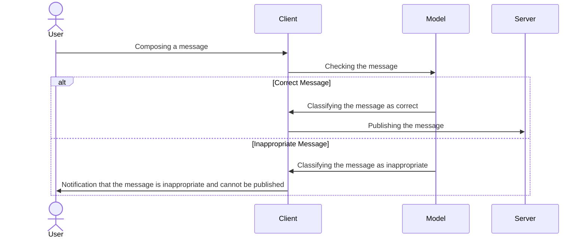

<h4 align="center">Cody ADAM & Mael KERICHARD</h4>

   
   

## 🌐 Quick Access

The project is available at the following address: [https://ai-kerichard-adam.vercel.app](https://ai-kerichard-adam.vercel.app).

> ⚠️ We are not responsible for the contents on the site. Our model does everything to filter inappropriate messages, but some may slip through the cracks.

> ℹ️ There is a small loading delay when composing a message for the first time, as the model needs time to load.

## 🤔 The Project

It's a very simplistic clone of X (formerly Twitter) that allows posting messages on a global thread.

The aim of this project is to implement a Machine Learning model that filters inappropriate messages, preventing their publication.

## 🛠️ Architecture and Technologies

To simplify development, validation is done on the client-side. Hence, the model is loaded in the user's browser.
It is loaded in a Web Worker to avoid blocking the main thread (see `app/worker.js`).

We use a small SQLite database to store messages. The server is managed by Next.js and deployed on Vercel.

We use the [_unitary/toxic-bert_](https://huggingface.co/unitary/toxic-bert) model (via [_Xenova/toxic-bert_](https://huggingface.co/Xenova/toxic-bert)
for Transformers.js) which is a pre-trained model for classifying inappropriate texts.

## ✅ Results

The model is quite effective, but it is not perfect. It is not uncommon for it to classify a correct message as inappropriate.

We chose to use a small model to reduce the loading time. This has an impact on the accuracy of the model.

We could have used a larger model, via requests to a server hosting the model, but this would have increased the complexity of the project,
and forced us to use a more powerful server.
